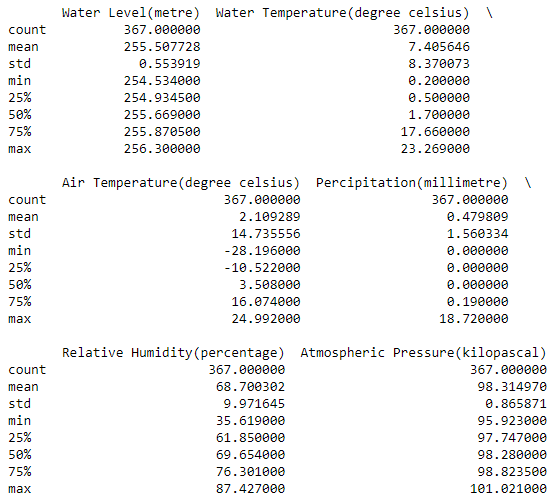
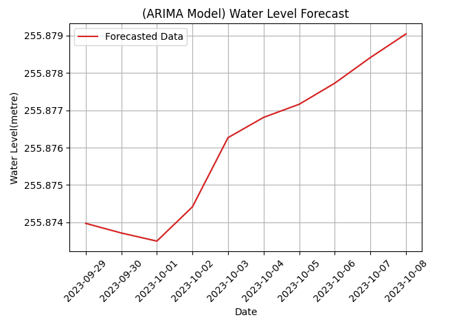
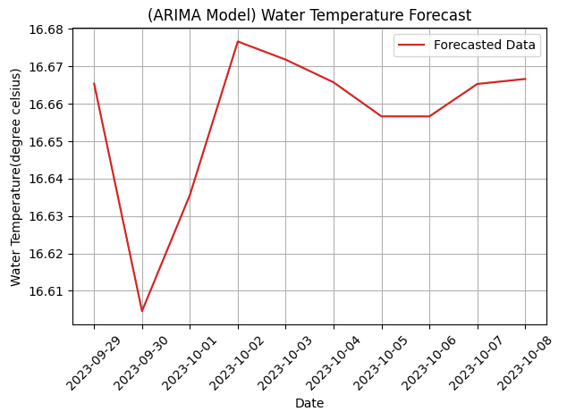
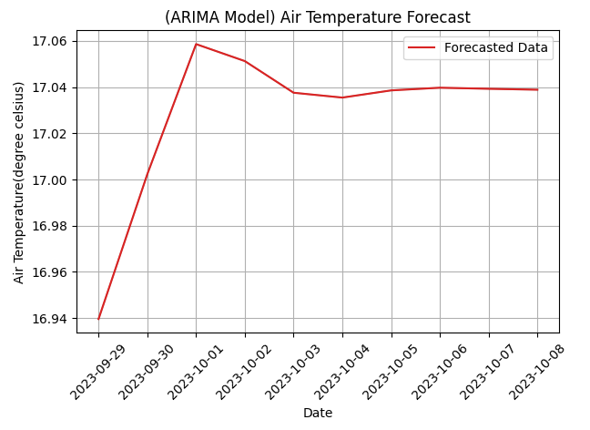
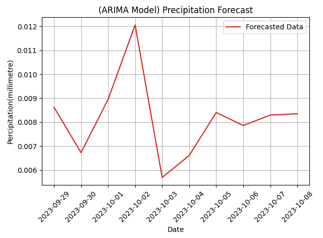
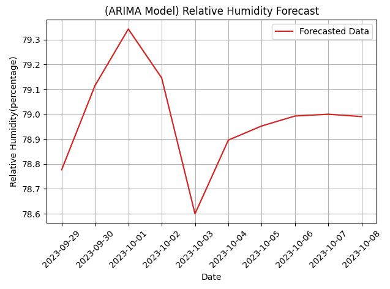
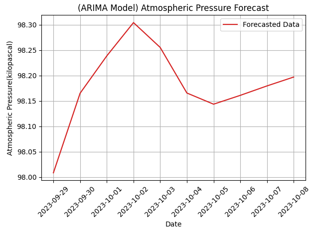

# Manitoba Hydro Hydrological Data Analysis for Cedar Lake near Oleson Point (MB Hydro)

## Table of Content

<b>(click to expand/hide)</b>

<!-- MarkdownTOC -->

- [Hydrological Data](#data)
- [Introduction](#intro)
- [Basic Data Summary](#data_summary)
- [Time Series Analysis](#time_series)
- [Arima Model Forecast](#arima_forecast)

<!-- /MarkdownTOC -->

## Hydrological Data
- From 2022 Sep 22nd to 2023 Sep 28th
- Dataset Source
  - [Manitoba Hyro Hydrological Data](https://www.hydro.mb.ca/hydrologicalData/static/stations/05KL701/station.html?v=20230928053337)

## Introduction
In this stage, we will conduct a preliminary analysis and forecast using the hydrological data from Cedar Lake near Oleson Point station, which has been provided by Manitoba Hydro.

## Basic Data Summary

---

## Time Series Analysis

---

---

---

---

---

---

## Arima Model Forecast 

---

---

---

---

---

---
