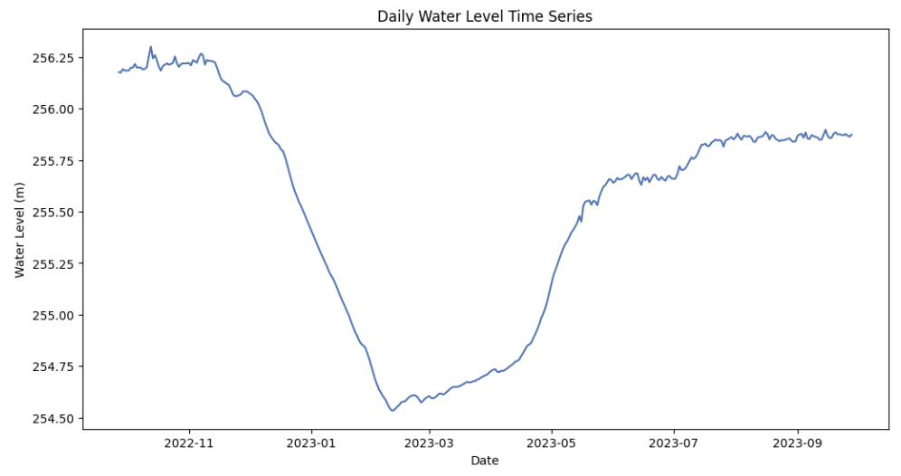
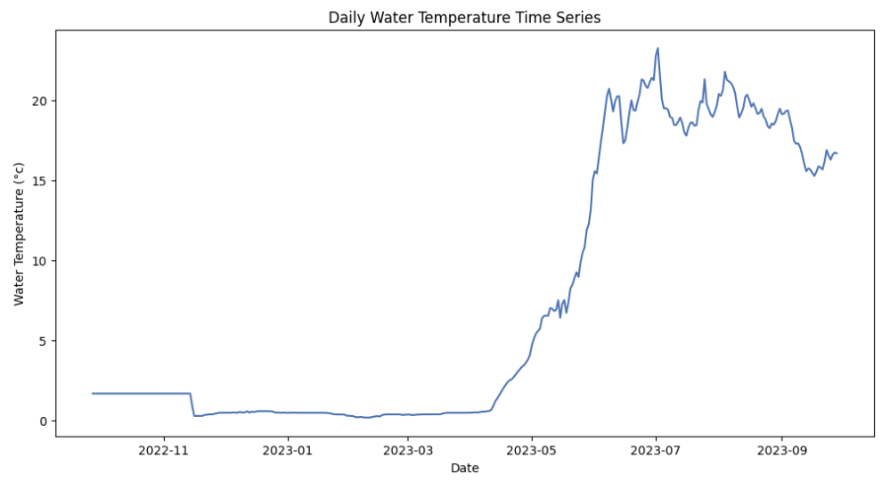
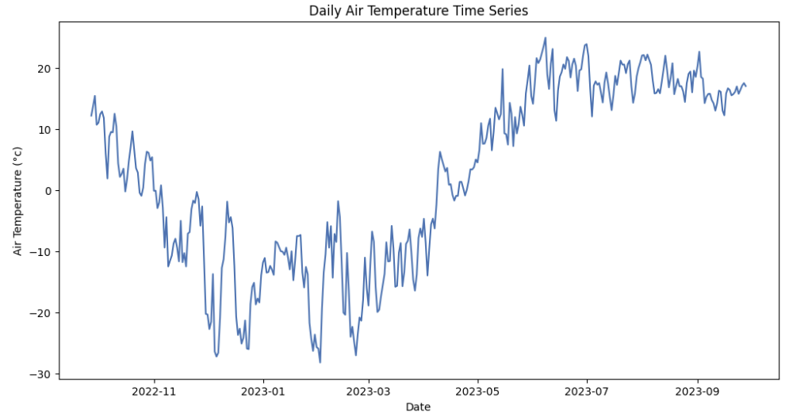
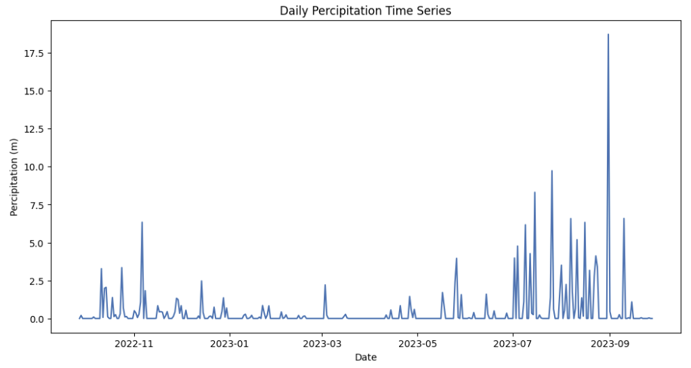
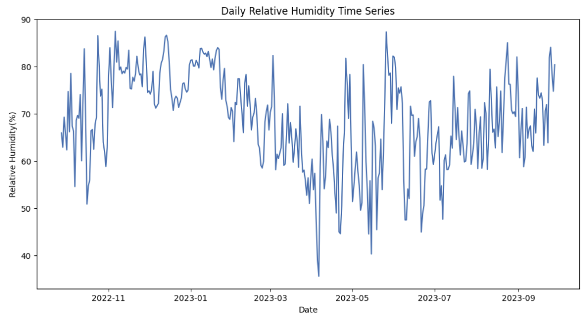
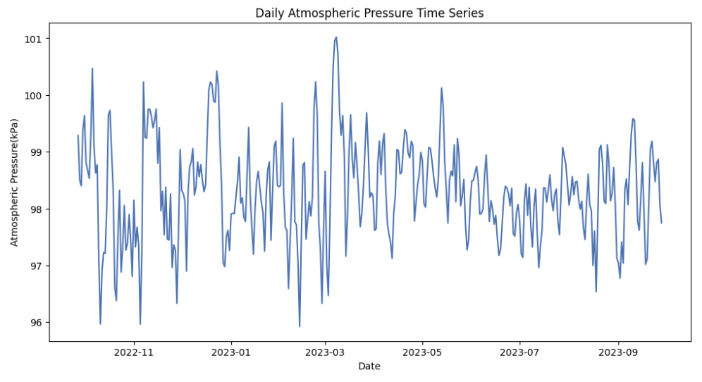
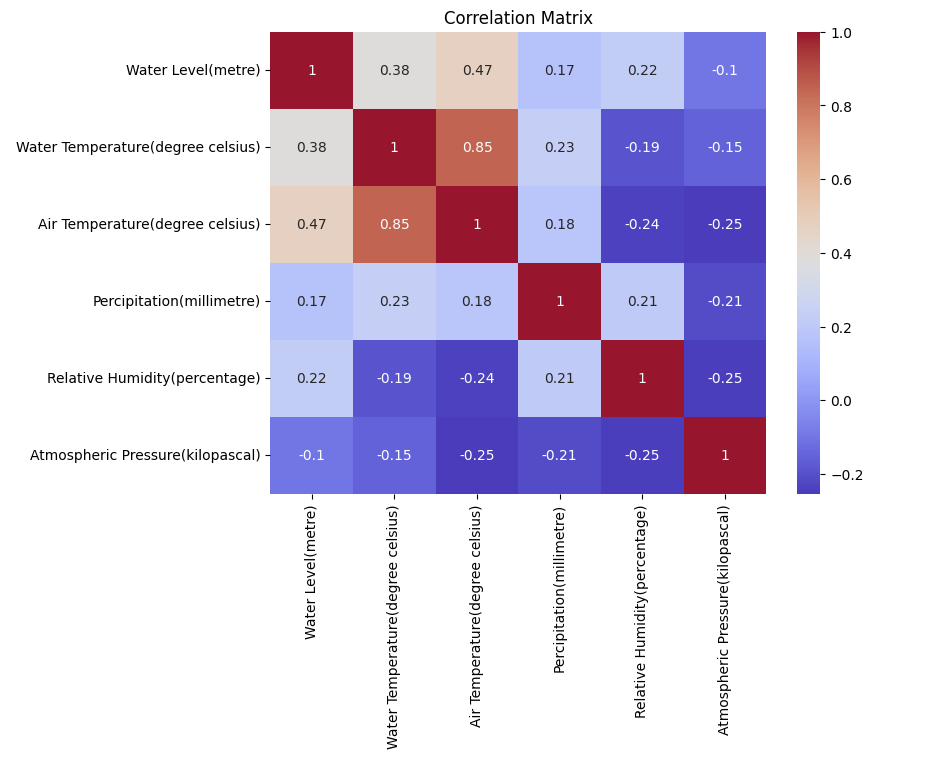

# Manitoba Hydro Hydrological Data Analysis for Cedar Lake near Oleson Point (MB Hydro)

## Introduction
In this stage, we will conduct a preliminary analysis and forecast using the hydrological data from Cedar Lake near Oleson Point station, which has been provided by Manitoba Hydro.

## Basic Data Summary

## Time Series Analysis

---

---

---

---

---

---

---

## Correlation Matrix

## Dataset Source
- [Manitoba Hyro](https://www.hydro.mb.ca/hydrologicalData/static/stations/05KL701/station.html?v=20230928053337)
